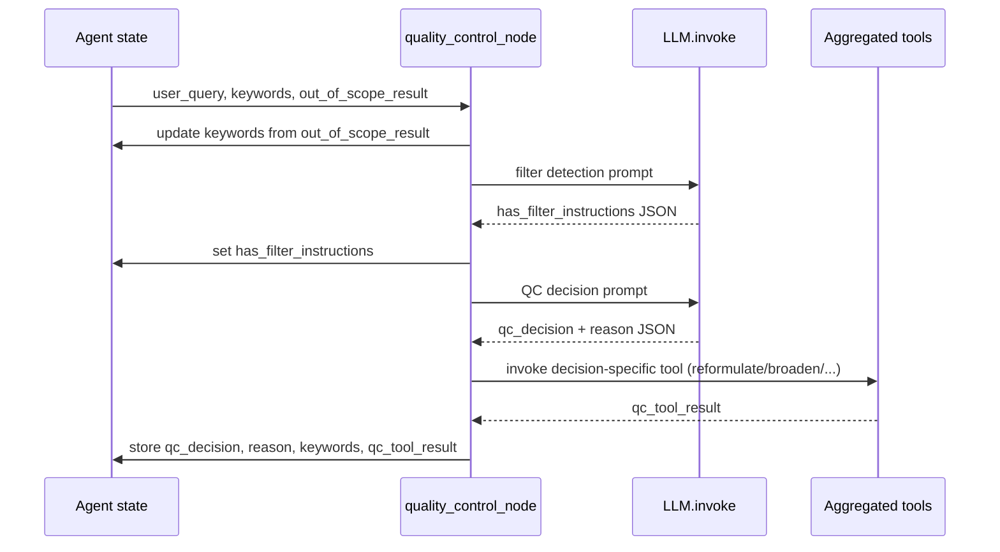

quality_control_node summary

Location: `llm/StategraphAgent.py` (`quality_control_node` function)

- Validates a research query, using prior out-of-scope signals plus two LLM prompts (filter detection and QC classification).
- Mutates state keys:
	- `keywords`: swap in tool-provided refinements.
	- `has_filter_instructions`: boolean from the filter probe.
	- `qc_decision` / `qc_decision_reason`: branch label and justification.
	- `qc_tool_result`: raw output from reformulate/broaden/narrow/split/accept tools.
	- `error`: set when any step fails.
- Drives downstream behavior: `has_filter_instructions` decides retrieval depth and filtering, `qc_tool_result` feeds subquery expansion and query updates, and `qc_decision` can shortcut to the out-of-scope handler.

### Sequence diagram

